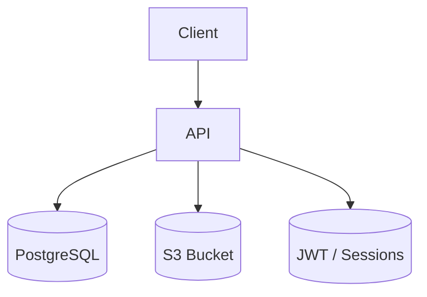
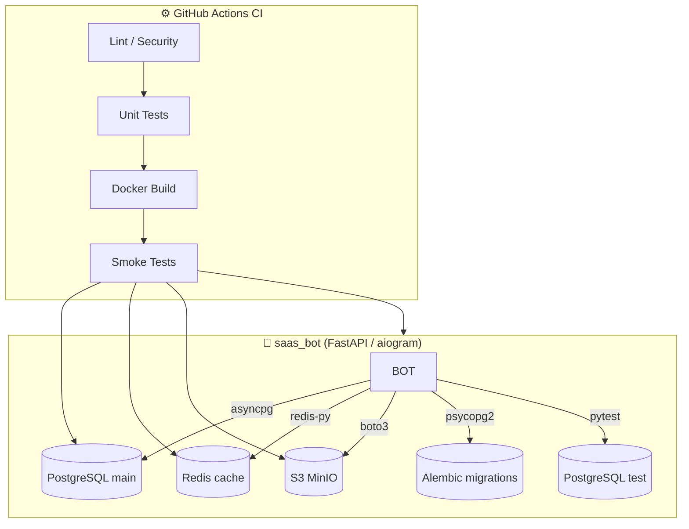
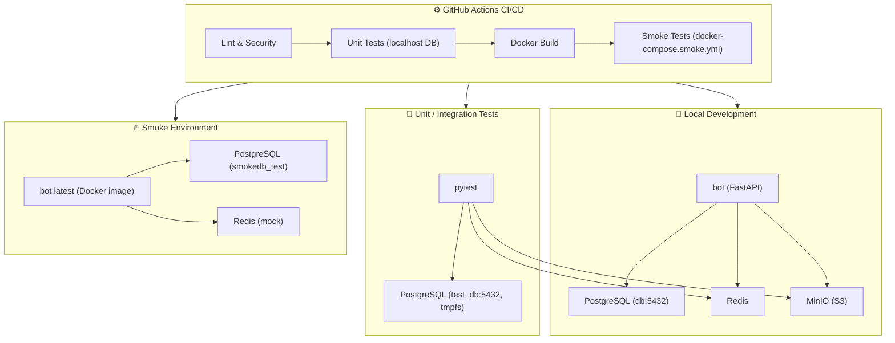
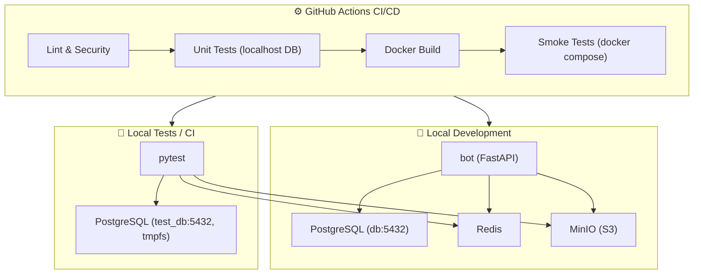
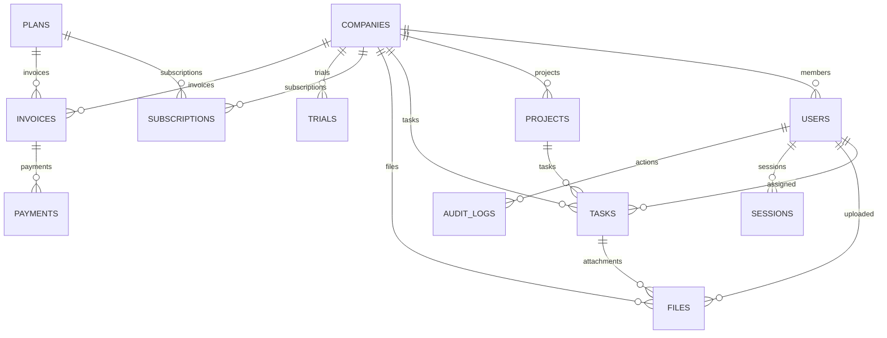

# 🚀 Project Documentation


> ⚙️ **Архитектура:** FastAPI + PostgreSQL + Redis + MinIO  
> 🧪 **Тесты:** pytest + Alembic + Docker Compose  
> 🧰 **CI/CD:** GitHub Actions с unit + smoke тестами  
> 🧱 **Деплой:** через Docker image (production-readya)


Добро пожаловать!  
Этот проект — backend-сервис для управления компаниями, пользователями, проектами, задачами, файлами и подписками.  

Документация 1сделана так, чтобы разработчик (даже новичок) мог **поднять проект за 10 минут** и быстро разобраться в архитектуре.  

---

## 📑 Оглавление
- [🚀 Запуск проекта](#-запуск-проекта)
- [🗄️ Архитектура сервисов](#️-архитектура-сервисов)
- [🧩 Архитектура окружений](#-архитектура-окружений)
- [🧭 Схема подключения окружений](#-схема-подключения-окружений)
- [📌 Проверка окружений](#-проверка-окружения)  
- [📊 ER-диаграмма базы](#-er-диаграмма-базы)
- [🔐 Роли и доступы](#-роли-и-доступы)
- [💳 Подписки и биллинг](#-подписки-и-биллинг)
- [📌 Полезные команды](#-полезные-команды)
- [🛠️ Деплой чеклист](#️-деплой-чеклист)
- [📘 CI/CD Pipeline](#-ci-cd-pipeline)
- [⚡ Миграции (Alembic)](#-миграции-alembic)
- [🐋 Конфигурация PostgreSQL](#-конфигурация-postgresql)  
- [🧠 Context-Aware Logging System for aiogram (structlog + contextvars)](#-ContextAware-LoggingSystem)
- [📈 Monitoring & Backups](#-Monitoring-Backups)
- [📚 Дополнительная документация](#-дополнительная-документация)


---

## 🚀 Запуск проекта

```bash
# Клонируем репозиторий
git clone <repo_url>
cd <repo_name>

# Настраиваем окружение
cp .env.example .env

# Сборка и запуск
make build
make up
````

После старта сервис будет доступен по адресу:
👉 [http://localhost:8000](http://localhost:8000)

---

## 🗄️ Архитектура сервисов

* **FastAPI** — основной backend
* **PostgreSQL** — база данных
* **Alembic** — миграции
* **Docker + docker-compose** — инфраструктура
* **S3-хранилище** — файлы и вложения
* **JWT + refresh-токены** — авторизация




---


## 🧩 Архитектура окружений и взаимодействие сервисов

Проект разделён на изолированные окружения:

| Окружение | Назначение | Описание |
|------------|-------------|----------|
| **Local** | Разработка | Работает через `docker compose`, использует `.env` |
| **Test** | Локальные тесты и CI | Использует `.env.test` и временную базу `saasdb_test` |
| **CI/CD** | GitHub Actions | Поднимает окружение через Docker Compose и выполняет smoke-тесты |
| **Production** | Продакшен | Использует `.env.production` или переменные окружения из секрета |

---

### 🧠 Логика взаимодействия компонентов



---

### ⚙️ Принцип работы локально

1. **Docker Compose** поднимает контейнеры:
   - `bot` — приложение
   - `db` — основная база PostgreSQL
   - `test_db` — тестовая база
   - `redis` — кэш
   - `minio` — S3-хранилище для файлов

2. **Переменные окружения** загружаются из `.env` и `.env.test`.

3. **Миграции** применяются внутри контейнера `bot` командой:
   ```bash
   docker compose run --rm bot alembic upgrade head
   ```

4. **Тесты** используют отдельную тестовую базу `saasdb_test`, чтобы не затронуть продовые данные.

---

### 🧪 Принцип работы в CI (GitHub Actions)

1. **Lint / Security** — проверяет стиль и уязвимости.  
2. **Unit Tests** — запускает тесты на чистом контейнере Postgres.  
3. **Docker Build** — собирает итоговый образ, который потом пойдёт в продакшен.  
4. **Smoke Tests** — запускает `docker compose` внутри CI, применяет миграции и проверяет, что образ реально работает.  

> 💡 Отчёты о тестах (HTML + JUnit XML) сохраняются в артефакты GitHub Actions.

---

### 🧱 Надёжность и масштабируемость

| Критерий | Оценка | Обоснование |
|-----------|--------|--------------|
| Изоляция окружений | ✅ | `.env`, `.env.test`, `.env.ci` полностью независимы |
| Повторяемость сборок | ✅ | Все стадии CI используют одни и те же Docker-контейнеры |
| Миграции | ✅ | Alembic централизован, синхронный и управляется через контейнер |
| Масштабирование | ✅ | Переход на Kubernetes возможен без изменений кода |
| Централизация настроек | ⚙️ Почти | Можно вынести общие переменные в `.env.shared` |
| Отладка и тестирование | ✅ | `pytest` и `smoke-tests` дают полный цикл проверки |

---

### 📂 Связанные файлы

| Файл | Назначение |
|------|-------------|
| `.env` | локальные переменные для `docker-compose` |
| `.env.test` | настройки тестовой базы |
| `.env.ci` | окружение CI/CD |
| `docker-compose.yml` | инфраструктура (db, redis, minio, bot) |
| `.github/workflows/ci.yml` | пайплайн GitHub Actions |
| `Dockerfile` | сборка финального образа |
| `alembic.ini` / `migrations/` | миграции базы данных |


---


### 🧭 Схема подключения окружений

# Обновление



---

### 🔹 Новое окружение `Smoke`

| Параметр                 | Значение                                                         |
| ------------------------ | ---------------------------------------------------------------- |
| **Конфигурация**         | `.env.smoke`                                                     |
| **Compose-файл**         | `docker-compose.smoke.yml`                                       |
| **База данных**          | `smokedb_test`                                                   |
| **Назначение**           | Проверка готового Docker-образа в условиях, близких к продакшену |
| **Миграции**             | Выполняются перед pytest внутри контейнера                       |
| **Команда запуска (CI)** |                                                                  |

```bash
docker compose -f docker-compose.smoke.yml --env-file .env.smoke up --build
```

---

### ⚙️ Сводка всех окружений

| Тип окружения     | Файл конфигурации | Compose-файл                    | База данных    | Назначение             |
| ----------------- | ----------------- | ------------------------------- | -------------- | ---------------------- |
| Local Dev         | `.env`            | `docker-compose.yml`            | `saasdb`       | Разработка             |
| Local Test        | `.env.test`       | `docker-compose.yml`            | `saasdb_test`  | Unit/Integration       |
| CI/CD             | `.env.ci`         | `docker-compose.yml`            | `saasdb_test`  | Unit-тесты             |
| **Smoke (новое)** | `.env.smoke`      | `docker-compose.smoke.yml`      | `smokedb_test` | Проверка Docker-образа |
| Production        | `.env.production` | `docker-compose.production.yml` | `saasdb`       | Продакшен              |




#### 🔹 Dev (разработка)

* База: `db:5432`
* Конфиг: `.env`
* Контейнеры: `bot`, `worker`, `db`, `redis`, `minio`

#### 🔹 Test (pytest)

* База: `test_db:5432`
* Конфиг: `.env.test`
* Данные не сохраняются (`tmpfs`)

#### 🔹 CI/CD (GitHub Actions)

* Линт, юнит-тесты, smoke-тесты
* Переменные окружения подгружаются из `.env.ci`
* Финальный Docker-образ проверяется на запуск


---

## 🧱 Проверка окружений

Этот раздел помогает убедиться, что каждое окружение работает корректно и изолированно.
Следующие команды можно выполнять локально, в контейнерах или в CI.


### 🔹 1. Проверка dev-окружения

```bash
# Пересобрать и поднять окружение разработки
make build
make up

# Проверить подключение к dev-базе
docker compose exec db psql -U saasuser -d saasdb -c '\dt'

# Проверить, что бот запущен
make logs
```

✅ Ожидаемый результат:

* контейнер `saasbot` в статусе *running*
* в логах видно `BOT_TOKEN: dummy...`
* таблицы в `saasdb` присутствуют после миграций

---

### 🔹 2. Проверка тестового окружения

```bash
# Запуск изолированных тестов с временной базой
make tloc
```

✅ Ожидаемый результат:

* база `saasdb_test` создаётся во временном контейнере `test_db`
* pytest показывает `5 passed in ...s`
* после завершения окружение очищается автоматически

> 💡 Тесты никогда не трогают dev-базу — используются переменные из `.env.test`.

---

### 🔹 3. Проверка CI/CD пайплайна локально (эмуляция)

```bash
# Проверяем, что пайплайн можно выполнить локально
act -j smoke-tests
```

> Если установлен [**nektos/act**](https://github.com/nektos/act),
> команда прогонит GitHub Actions прямо на твоей машине.

✅ Ожидаемый результат:

* проходят lint, unit, smoke тесты
* создаётся артефакт `smoke-test-results/`

---

### ⚙️ Итоговое соответствие окружений

| Тип окружения | Файл конфигурации | База данных   | Назначение                   |
| ------------- | ----------------- | ------------- | ---------------------------- |
| Local Dev     | `.env`            | `saasdb`      | Основная разработка          |
| Local Test    | `.env.test`       | `saasdb_test` | Изолированные pytest-тесты   |
| CI/CD         | `.env.ci`         | `saasdb_test` | Smoke и unit тесты в Actions |
| Production    | `.env.production` | `saasdb`      | Рабочая среда                |


---

## 📊 ER-диаграмма базы



---

## 🔐 Роли и доступы

* **Admin** — полный доступ ко всем данным и настройкам.
* **Manager** — управление проектами, пользователями компании.
* **Worker** — выполнение задач, загрузка файлов.
* **Client** — просмотр проектов и подтверждение выполненных работ.

📚 Подробнее: [docs/roles.md](docs/roles.md)

---

## 💳 Подписки и биллинг

* **Trial** — бесплатный пробный период.
* **Subscription** — платная подписка (привязка к плану).
* **Invoice** — счет компании.
* **Payment** — оплата по счету.

📚 Подробнее: [docs/db\_cascades.md](docs/db_cascades.md)

---

## 📌 Полезные команды

```bash
make build      # собрать контейнеры
make up         # запустить проект
make down       # остановить проект
make logs       # посмотреть логи
make shell      # попасть внутрь контейнера
make migrate    # применить миграции
make revision   # создать новую миграцию
```

---

## 🛠️ Деплой чеклист

* [ ] Обновить `.env`
* [ ] Применить миграции (`make migrate`)
* [ ] Проверить состояние подписок и триалов
* [ ] Проверить работу S3-хранилища
* [ ] Прогнать тесты перед релизом


---

## 📘 CI/CD Pipeline

### 🎯 Что тестируется в пайплайне

В проекте используется единый workflow **CI Pipeline**:

* **Lint**: проверка стиля и безопасности (ruff, black, flake8, bandit, safety)
* **Unit tests**: тесты в изолированном Postgres (service container), покрытие через pytest + coverage
* **Smoke tests**: базовые сценарии работы приложения

### 🔄 Конфигурация окружения

* **.env** — базовая среда для docker-compose
* **.env.local** — локальные секреты (токены, ключи)
* **.env.ci** — тестовые переменные для CI/CD


---

## ⚡ Миграции (Alembic)

В проекте используется **асинхронный Alembic** для работы с PostgreSQL.
Это гарантирует совместимость с `async SQLAlchemy` и исключает необходимость переделки схемы в будущем.

### 🔄 Изменения, которые мы внесли:

1. **Асинхронный движок**
```python
from sqlalchemy.ext.asyncio import create_async_engine
connectable = create_async_engine(
 url,
 future=True,
 echo=os.getenv("DEBUG") == "1"
)
```

2. **Разделение окружений**
* Используем `ENV=production` для продакшена
* Локально и в CI подхватываем `DATABASE_URL` / `TEST_DATABASE_URL`

3. **Логирование**
```python
logger.setLevel(logging.DEBUG if os.getenv("DEBUG") else logging.INFO)
```

4. **Обработка ошибок**
```python
try:
 asyncio.run(run_migrations_online())
except Exception as e:
 logger.critical(f"Критическая ошибка при выполнении миграций: {e}")
 raise
```

5. **alembic.ini**
В `alembic.ini` строка `sqlalchemy.url` оставлена пустой:
```ini
sqlalchemy.url =
```
URL теперь всегда берётся из переменных окружения.

---

### 📋 Как применять миграции

**Локально:**
```bash
make revision # создать новую миграцию
make migrate # применить миграции
```

**В CI:**
* Автоматически выполняются smoke-тесты и миграции
* Используется `TEST_DATABASE_URL`
* В случае ошибки миграции пайплайн падает

**В продакшене:**
```bash
ENV=production make migrate
```


---


## 🐋 Конфигурация PostgreSQL

### 📊 Окружения и базы данных

В проекте используются разные базы данных для разных окружений:

**Продакшен-окружение:**
* Основная база данных: `saasdb`
* Используется в продакшен-боте и воркере

**Тестовые окружения:**
* Тестовая база данных: `saasdb_test`
* Используется в CI и локальных тестах

### 🔄 Переменные окружения

Для всех окружений используются атомарные переменные:
* `POSTGRES_USER`
* `POSTGRES_PASSWORD`
* `POSTGRES_HOST`
* `POSTGRES_PORT`
* `POSTGRES_DB`

Такой подход:
* Устраняет дублирование настроек
* Исключает расхождения между `DATABASE_URL` и `TEST_DATABASE_URL`
* Делает конфигурацию более прозрачной

### 📋 Примеры конфигураций

**Локальная разработка** (.env.local):
```env
POSTGRES_USER=saasuser
POSTGRES_PASSWORD=saaspass
POSTGRES_HOST=db
POSTGRES_PORT=5432
POSTGRES_DB=saasdb


---


```
# 📦 Context-Aware Logging System for aiogram (structlog + contextvars)

## 🎯 Цель

Обеспечить **структурированные JSON-логи** с уникальными контекстами:

* `request_id` — уникальный ID запроса (генерируется для каждого апдейта);
* `user_id` — ID пользователя Telegram (если доступен);
* `chat_id` — ID чата (группового или личного);
* `username` — Telegram username пользователя (если есть);
* `company_id` — ID компании (опционально, задаётся динамически).

---

## ⚙️ Структура проекта

```
saas_bot/
│
├── core/
│   ├── context.py
│   ├── logging_setup.py
│   └── middlewares/
│       └── context_middleware.py
│
├── handlers/
│   └── example_handler.py
│
├── main.py
└── README.md
```

---

## 🧩 core/context.py

```python
import contextvars

request_id = contextvars.ContextVar("request_id", default=None)
user_id = contextvars.ContextVar("user_id", default=None)
chat_id = contextvars.ContextVar("chat_id", default=None)
username = contextvars.ContextVar("username", default=None)
company_id = contextvars.ContextVar("company_id", default=None)
```

---

## 🧱 core/middlewares/context_middleware.py

```python
import uuid
from typing import Any, Callable
from core.context import request_id, user_id, company_id, chat_id, username


class ContextMiddleware:
    """
    Middleware для aiogram-style (handler, event, data).
    Устанавливает request_id, user_id, chat_id, username, company_id
    и гарантированно сбрасывает контекст после обработки апдейта.
    """

    async def __call__(self, handler: Callable, event: Any, data: dict):
        token_req = request_id.set(str(uuid.uuid4()))
        token_user = user_id.set(None)
        token_company = company_id.set(None)
        token_chat = chat_id.set(None)
        token_username = username.set(None)

        try:
            if hasattr(event, "from_user") and event.from_user:
                user_id.set(getattr(event.from_user, "id", None))
                username.set(getattr(event.from_user, "username", None))
            if hasattr(event, "chat") and event.chat:
                chat_id.set(getattr(event.chat, "id", None))

            return await handler(event, data)
        finally:
            # Всегда очищаем контекст — чтобы не утекал между апдейтами
            request_id.reset(token_req)
            user_id.reset(token_user)
            company_id.reset(token_company)
            chat_id.reset(token_chat)
            username.reset(token_username)
```

---

## 🧱 core/logging_setup.py

```python
import logging
import structlog
from core.context import request_id, user_id, company_id, chat_id, username


def add_context(logger, method_name, event_dict):
    """Добавляет контекстные переменные в каждый лог."""
    event_dict["request_id"] = request_id.get()
    event_dict["user_id"] = user_id.get()
    event_dict["chat_id"] = chat_id.get()
    event_dict["username"] = username.get()
    event_dict["company_id"] = company_id.get()
    return event_dict


def setup_logging(level: int = logging.INFO, dev_mode: bool = False):
    """Настройка структурированных логов."""
    processors = [
        structlog.processors.TimeStamper(fmt="iso"),
        structlog.processors.add_log_level,
        add_context,
    ]

    if dev_mode:
        processors.append(structlog.dev.ConsoleRenderer())  # цветной вывод
    else:
        processors.extend([
            structlog.processors.StackInfoRenderer(),
            structlog.processors.format_exc_info,
            structlog.processors.JSONRenderer(),
        ])

    structlog.configure(
        processors=processors,
        logger_factory=structlog.stdlib.LoggerFactory(),
        wrapper_class=structlog.make_filtering_bound_logger(level),
        cache_logger_on_first_use=True,
    )
```

---

## 🪄 handlers/example_handler.py

```python
import structlog
from core.context import company_id

logger = structlog.get_logger(__name__)

async def example_handler(event):
    logger.info("handler.start", event_type=getattr(event, "type", None))

    # Пример: lookup компании
    found_company_id = 42
    if found_company_id:
        company_id.set(found_company_id)
        logger.info("company.assigned")

    logger.info("handler.finish")
```

---

## 🚀 main.py

```python
import asyncio
import structlog
from aiogram import Bot, Dispatcher
from aiogram.client.default import DefaultBotProperties
from core.logging_setup import setup_logging
from core.middlewares.context_middleware import ContextMiddleware
from handlers.example_handler import example_handler

setup_logging(dev_mode=False)  # False = JSON, True = цветной DEV
logger = structlog.get_logger()

BOT_TOKEN = "YOUR_TOKEN"

async def main():
    bot = Bot(token=BOT_TOKEN, default=DefaultBotProperties(parse_mode="HTML"))
    dp = Dispatcher()
    dp.message.middleware(ContextMiddleware())

    dp.message.register(example_handler)
    logger.info("bot.start")

    await dp.start_polling(bot)

if __name__ == "__main__":
    asyncio.run(main())
```

---

## 🧱 Безопасность и изоляция контекста

Благодаря `contextvars`, каждый апдейт Telegram обрабатывается в **своём контексте**:

* значения `request_id`, `user_id`, `chat_id`, `username` и `company_id`
  **не пересекаются между задачами**;
* контекст **очищается** после обработки каждого апдейта;
* полностью совместим с `asyncio`, `aiogram` и `FastAPI`;
* безопасен даже при высокой нагрузке или в Docker-кластере.

---

## 🧪 Пример реального лога (JSON)

```json
{
  "timestamp": "2025-10-09T12:42:01.692Z",
  "level": "info",
  "event": "handler.start",
  "request_id": "d1e1b9a0-837a-4a84-90a9-512fb2945c4a",
  "user_id": 7648460182,
  "username": "john_doe",
  "chat_id": 7648460182,
  "company_id": 42
}
```

---

## 🧰 Dockerfile (пример)

```dockerfile
FROM python:3.12-slim

WORKDIR /app

COPY requirements.txt requirements-dev.txt ./
RUN pip install --no-cache-dir -r requirements.txt -r requirements-dev.txt

COPY . .

ENV PYTHONUNBUFFERED=1

CMD ["python", "main.py"]
```

---

## ✅ Проверка логов

Запусти:

```bash
docker-compose up -d bot
docker-compose logs -f bot
```

Если всё корректно, ты увидишь JSON-логи с контекстом (`request_id`, `user_id`, `chat_id`, `username`, `company_id`).


---


## 📈 Monitoring & Backups

### 🔹 Метрики и health-check

После запуска сервиса доступны эндпоинты:

| Endpoint   | Назначение                                                    |
| ---------- | ------------------------------------------------------------- |
| `/healthz` | Проверка доступности контейнера                               |
| `/metrics` | Prometheus-метрики (latency, errors, requests, db-пул и т.п.) |

Порт можно задать в `.env`:

```env
METRICS_PORT=8080
```

Для сбора метрик можно подключить Prometheus:

```yaml
scrape_configs:
  - job_name: 'saas_bot'
    static_configs:
      - targets: ['localhost:8080']
```

---

### 🔹 Авто-бэкап при остановке контейнера

Контейнер автоматически делает бэкап при завершении (SIGTERM, SIGINT).
Файлы сохраняются в `/app/backups`:

```bash
backup_saasdb_2025-10-09_23-45.sql.gz
```

Ручной запуск:

```bash
bash backups/backup_db.sh
```

Рекомендуется добавить cron или GitHub Action для плановых бэкапов.

---

### 🔹 Runbook

* 🩺 **Проверить доступность:** `curl http://localhost:8080/healthz`
* 📊 **Проверить метрики:** `curl http://localhost:8080/metrics | head`
* 💾 **Проверить бэкап:** `ls -lh backups/`

---

Хочешь, я тебе сразу сгенерирую Git-команды для пуша этого патча, чтобы завтра просто вставить в терминал и применить безопасно (с `git apply`, `git add`, `git commit`, `git push`)?


---


## 📚 Дополнительная документация

* [Роли и доступы](docs/roles.md)
* [Каскады и удаление](docs/db_cascades.md)
* [Чеклист каскадов (ручная проверка)](docs/db_cascades_checklist.md)  
* [Миграции и CI/CD](docs/migrations.md)
* [Runbook — эксплуатация бота](docs/runbook.md)

---
# test CI trigger
