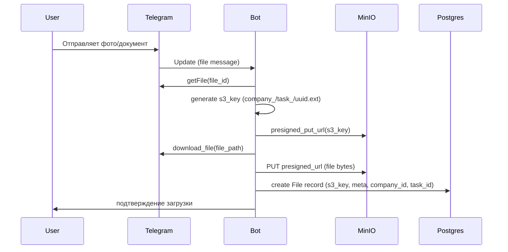
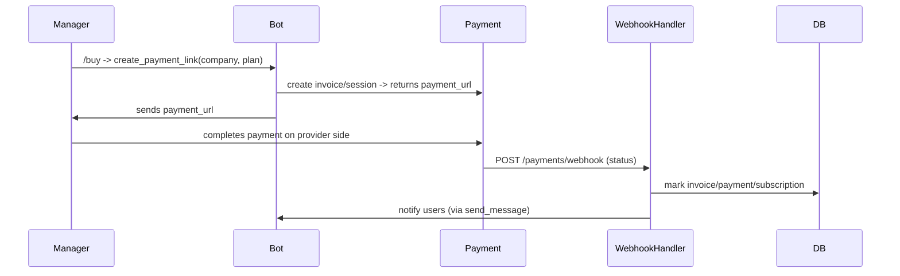

# Инженерная карта — архитектура, модули и потоки данных

> Документ — детальная инженерная схема проекта (UML-подобная карта модулей, data-flow, middlewares, критичные замечания и рекомендации). Подготовлено под текущую codebase (aiogram + FastAPI health + SQLAlchemy async + Docker Compose + MinIO/Redis).

---

## Короткое резюме

Проект уже построен в модульном стиле: `handlers` (телеграм-команды), `services` (бизнес-логика), `models` (ORM), `middlewares` (перехватчики) и `storage` (S3/MinIO). Это хорошая основа для SaaS. В этой карте описаны текущие компоненты, ключевые потоки данных (Create Company / Upload File / Payment), выявлены архитектурные риски и практические рекомендации по исправлению и масштабированию.

---

# 1. Высокоуровневая архитектура (компоненты)

**Компоненты:**

* **Bot Service (aiogram)** — основной процесс, содержащий `dp.start_polling`, маршруты (`handlers/`), middlewares и background task `billing_notifier`. Обрабатывает входящие апдейты от Telegram.
* **Web Health Server** — aiohttp-приложение для `/healthz` и `/metrics` (Prometheus). Запускается в том же процессе.
* **PostgreSQL** — основная БД (multi-tenant через company_id).
* **Redis** — кеш / брокер задач (планируется для фоновых задач и rate-limiting).
* **MinIO (S3-compatible)** — объектное хранилище для файлов.
* **CI/CD (GitHub Actions)** — Lint → Unit → Build → Smoke tests.
* **Monitoring**: Hawk (hawkcatcher) + Prometheus endpoint.
* **Платёжный провайдер** — внешний (планируется YooKassa/другой) + webhook handler.

```mermaid
flowchart LR
  subgraph External
    Telegram[Telegram API]
    PaymentProvider[Payment Provider (YooKassa/...)]
  end

  subgraph Infra
    LB[Load Balancer / Proxy]
    Bot[Bot Service (aiogram)]
    Worker[Background Worker / Scheduler]
    Web[Optional Web UI / FastAPI]
    Postgres[(Postgres)]
    Redis[(Redis)]
    MinIO[(MinIO / S3)]
    Prom[Prometheus]
    Hawk[Hawkcatcher]
  end

  Telegram -->|updates (polling or webhook)| Bot
  Bot -->|DB session| Postgres
  Bot -->|presigned PUT/GET| MinIO
  Bot -->|publish job| Redis
  Worker -->|jobs (billing, notifications)| Postgres
  PaymentProvider -->|webhook| Bot
  Bot -->|metrics| Prom
  Bot -->|errors| Hawk
  Web -->|API/DB| Postgres
  LB --> Bot
  LB --> Web
```

---

# 2. Ключевые потоки данных (sequence)

## 2.1 File upload (user → task)



**Контрольные точки безопасности:**

* s3_key содержит `company_{id}/...` — хорошая изоляция объектов между клиентами.
* Валидация MIME / size / extension перед загрузкой.
* Проверка доступа: file.company_id == user.company_id.

## 2.2 Payment flow (создание ссылки и подтверждение)



**Замечание:** webhook handler должен быть публичен (TLS, IP allowlist optional), idempotent и валидировать подпись от провайдера.

## 2.3 Subscription enforcement / notification

* `billing_notifier` (текущая фон. задача в `main.py`) запускает:

  * `notify_expiring_trials` — пуш/сообщение/EMail
  * `notify_expiring_subscriptions`
  * `enforce_expirations` — блокировка функционала компании

**Рекомендация:** вынести в отдельный worker/process (cron/beat) и использовать брокер (Redis/Celery/RQ) вместо loop внутри процесса бота.

---

# 3. Модель данных — кратко

**Основные сущности:**

`Company`, `User`, `Project`, `Task`, `File`, `Trial`, `Plan`, `Subscription`, `Invoice`, `Payment`, `AuditLog`.

**Ключевые связи:** один-to-многие между Company → (Users, Projects, Tasks, Files, Subscriptions, Trials).

---

# 4. Сильные стороны текущей реализации

* Чёткое разделение handler/service/model.
* Мульти-тенантная модель с изоляцией company_id.
* Presigned S3 и префиксы `company_{id}` — безопасность.
* Prometheus endpoint и Hawk — мониторинг.
* CI pipeline и изолированные test-среды — зрелый подход.

---

# 5. Риски и улучшения

(описаны в исходной версии: транзакции, фоновые задачи, логирование, datetime, безопасность файлов, enum согласованность, webhooks idempotency).

---

# 6. Инфраструктурная рекомендация (MVP-ready)

**Docker Compose (MVP)**:

* bot (aiogram)
* worker (billing jobs)
* web (health/admin)
* postgres, redis, minio, prometheus

**Продакшн:** Kubernetes, managed Postgres и S3, secrets manager, HTTPS и load balancing.

---

# 7. Checklist — краткая проверка архитектуры

* [ ] Alembic миграции и актуальная схема БД
* [ ] Централизованное JSON логирование
* [ ] Единый подход к транзакциям
* [ ] Фоновые задачи вынесены в отдельный сервис
* [ ] Webhook платежей idempotent и проверяет подпись
* [ ] Presigned URLs безопасны, истекают ≤1ч
* [ ] Проверка company_id во всех сервисах
* [ ] Полные e2e тесты: проекты, задачи, файлы, биллинг
* [ ] Автоматические бэкапы и runbook восстановления
* [ ] Мониторинг через Prometheus + дашборд в Grafana

---

# 8. Что я подготовлю дальше

✅ **Следующим шагом** — разработка:

* **Детальной дорожной карты (roadmap)** на 10–14 дней.
* С указанием фаз (Phase 1–4): инфраструктура, логирование и мониторинг, CI/CD, SaaS-функционал.
* Каждая фаза будет содержать приоритеты, задачи, ориентировочное время и зависимости.

При желании могу дополнительно:

* Визуализировать архитектурную схему (PNG/SVG) из Mermaid;
* Составить карту зависимостей модулей и точек расширения (Extension Points) для SaaS.

---

*Конец инженерной карты. Переход к созданию Roadmap — следующая стадия.*
