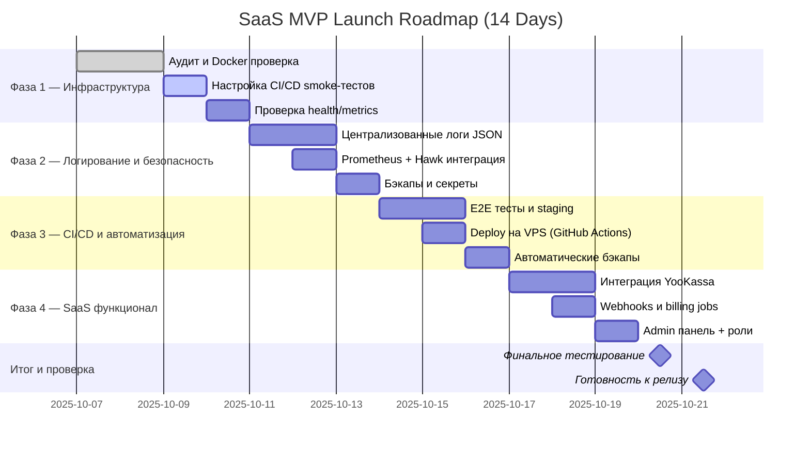

# 🚀 SaaS Roadmap — 14-Day MVP Launch Plan

> Формат: гибридный — инженерная структура + таблица задач + визуальная диаграмма Gantt. Каждая фаза имеет чёткие цели, deliverables, чек-листы и визуальную линию времени для общего видения проекта.

---

## 🌐 Общая цель

**Вывести Telegram Bot + Backend в готовый SaaS-MVP**, который можно:

* демонстрировать инвесторам/партнёрам,
* продавать клиентам (через подписку),
* масштабировать без архитектурных переделок.

---

# 📊 Визуальная диаграмма прогресса (Gantt Timeline)

📅 *Итого: 14 календарных дней. Каждая фаза занимает 2–4 дня, с буфером для тестов и мелких фиксов.*

---

# ⚙️ Фаза 1 — Аудит и инфраструктура (день 1–3)

**Цель:** убедиться, что проект стабилен, воспроизводим и готов к деплою.

### 🔧 Основные задачи

| № | Задача                            | Цель                        | Статус |
| - | --------------------------------- | --------------------------- | ------ |
| 1 | Проверить Alembic миграции        | Актуализировать схему БД    | ☐      |
| 2 | Настроить `.env` и `.env.example` | Единое конфиг-хранилище     | ☐      |
| 3 | Проверить Docker Compose          | Изолировать окружения       | ☐      |
| 4 | Настроить CI smoke-тесты          | Проверить сборку            | ☐      |
| 5 | Проверить healthcheck             | Включить базовый мониторинг | ☐      |

✅ Deliverables: проект поднимается, CI зелёный, метрики работают.

---

# 🧩 Фаза 2 — Логирование, мониторинг, безопасность (день 4–6)

**Цель:** улучшить наблюдаемость и защиту.

| № | Задача                              | Цель                   | Статус |
| - | ----------------------------------- | ---------------------- | ------ |
| 1 | Ввести централизованное логирование | Аналитика и дебаг      | ☐      |
| 2 | Проверить middleware транзакций     | Безопасность данных    | ☐      |
| 3 | Настроить Hawk / Sentry             | Отслеживание ошибок    | ☐      |
| 4 | Проверить Prometheus метрики        | Интеграция с Grafana   | ☐      |
| 5 | Добавить бэкапы и секреты           | Безопасность окружений | ☐      |

✅ Deliverables: JSON-логи, Hawk активен, метрики собираются.

---

# 💼 Фаза 3 — CI/CD и автоматизация (день 7–10)

**Цель:** автоматический деплой и тестирование end-to-end.

| № | Задача                          | Цель                 | Статус |
| - | ------------------------------- | -------------------- | ------ |
| 1 | Добавить e2e тесты              | Проверка сценариев   | ☐      |
| 2 | Настроить деплой (GitHub → VPS) | Автоматический релиз | ☐      |
| 3 | Настроить staging               | Тест перед продом    | ☐      |
| 4 | Проверить миграции и rollbacks  | Безопасность данных  | ☐      |

✅ Deliverables: CI/CD полный цикл, deploy ≤10 мин.

---

# 💰 Фаза 4 — SaaS-функционал (день 11–14)

**Цель:** завершить оплату, триалы, админку.

| № | Задача                         | Цель                 | Статус |
| - | ------------------------------ | -------------------- | ------ |
| 1 | Интегрировать YooKassa         | Получение оплат      | ☐      |
| 2 | Настроить webhook для платежей | Автоматизация        | ☐      |
| 3 | Проверить trial/renew сценарии | Продление подписок   | ☐      |
| 4 | Добавить админ-панель          | Управление клиентами | ☐      |

✅ Deliverables: пользователь оплачивает, бот активирует подписку.

---

# 🧭 Финальный чек-лист перед SaaS релизом

* [ ] Все контейнеры стабильны
* [ ] Логи централизованы
* [ ] Метрики и алерты активны
* [ ] Подписки и оплаты работают
* [ ] CI/CD весь цикл автоматизирован
* [ ] Готов лендинг и документация

---

📈 *После реализации этой дорожной карты система готова к MVP релизу SaaS уровня: масштабируема, наблюдаема и безопасна.*
